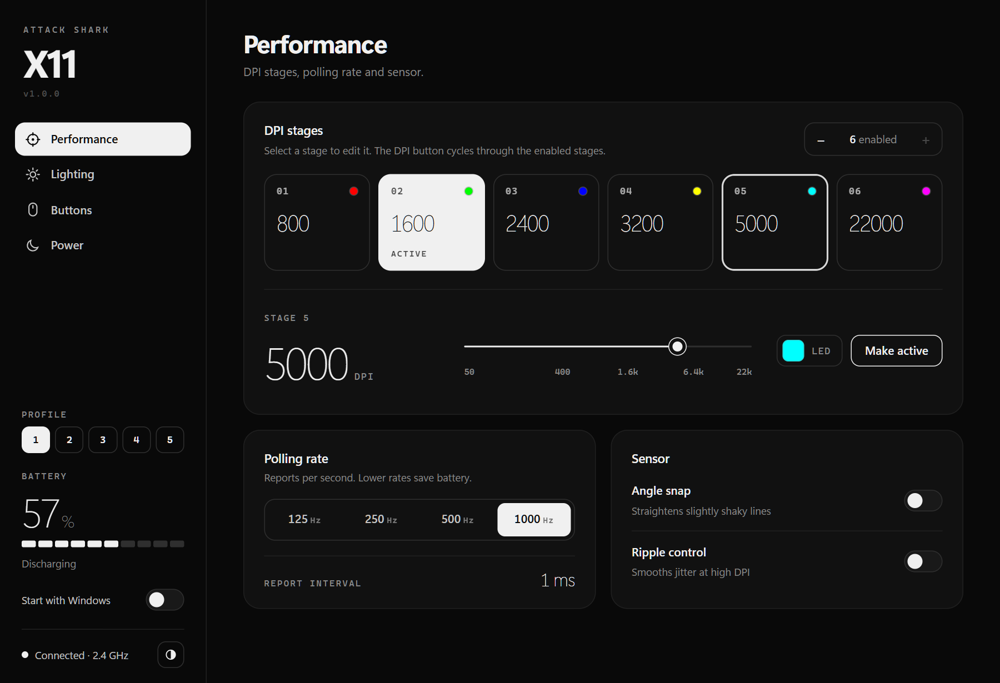
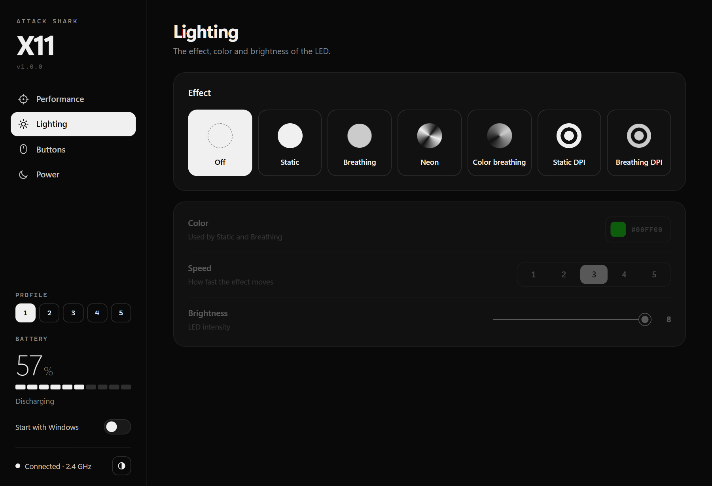
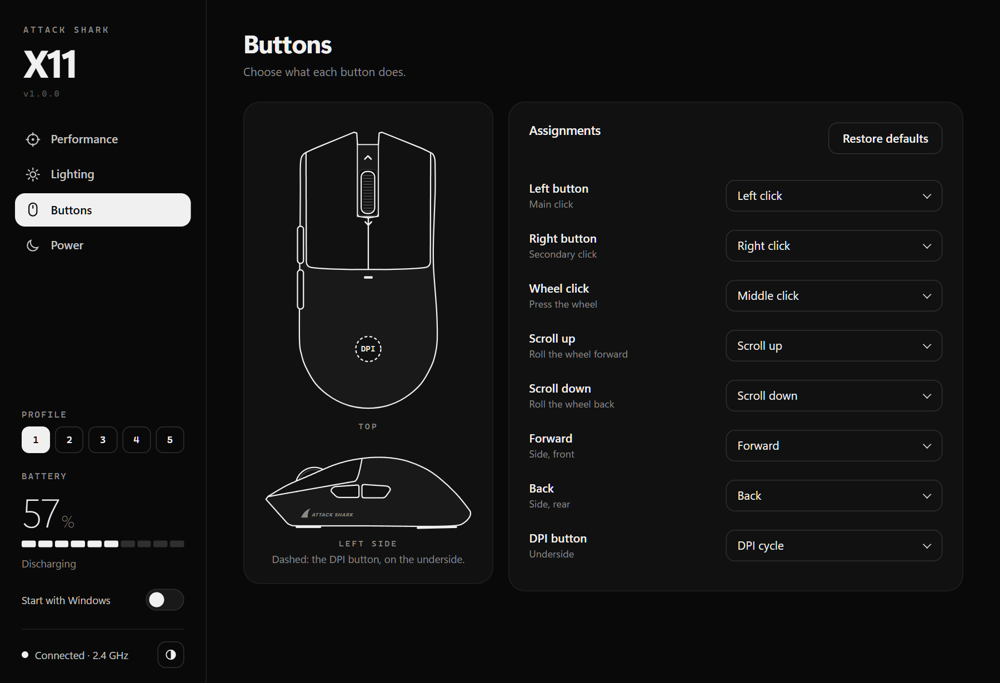
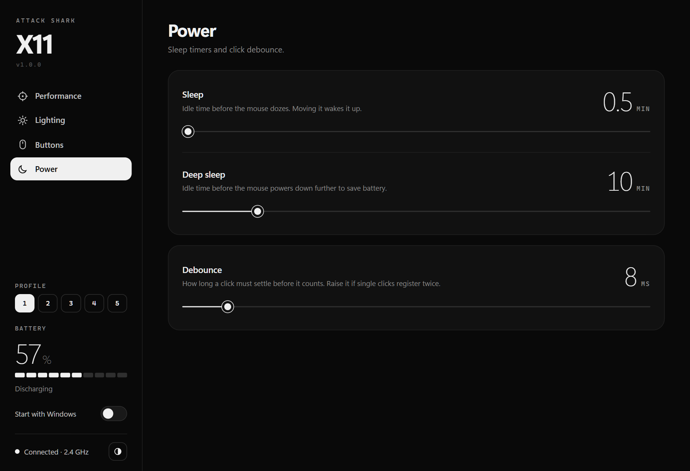

<div align="center">

# Attack Shark X11

**Settings and battery monitoring for the Attack Shark X11 wireless mouse, on Windows, macOS and Linux.**

[](https://github.com/LincolnCFCruz/x11-companion/actions/workflows/ci.yml)
[](https://github.com/LincolnCFCruz/x11-companion/releases/latest)
[](LICENSE)




</div>

> [!NOTE]
> This is an unofficial project, not affiliated with or endorsed by Attack Shark. It communicates with the mouse the
> same way the official software does, using a community-documented protocol verified on real hardware.

**Contents:** [Features](#features) · [Download](#download) · [Getting started](#getting-started) ·
[Usage](#usage) · [Command-line tool](#command-line-tool) · [Troubleshooting](#troubleshooting) ·
[Building from source](#building-from-source) · [Releasing](#releasing) · [Project structure](#project-structure) ·
[Safety](#safety) · [Acknowledgements](#acknowledgements) · [License](#license)

## Features

- **DPI:** six stages from 50 to 22000 DPI, the active stage, how many stages the DPI button cycles through, and each
  stage's LED color.
- **Polling rate:** 125, 250, 500 or 1000 Hz.
- **Sensor:** angle snap and ripple control.
- **Lighting:** seven modes, with color, speed and brightness.
- **Buttons:** remap any button to a mouse, DPI, media or browser action, or to a keyboard shortcut recorded by
  pressing it.
- **Power:** sleep and deep-sleep timers, and click debounce.
- **Profiles:** switch between the mouse's five onboard profiles.
- **Battery:** the level in the system tray, alerts at 15% and 5%, and live updates in the window.
- **Start at login:** optionally, straight to the tray.

Every change is written to the mouse's onboard memory and confirmed by the mouse, so your settings travel with it to
any computer.

| Lighting | Buttons | Power |
|:---:|:---:|:---:|
|  |  |  |

## Download

Download the files for your system from the
[latest release](https://github.com/LincolnCFCruz/x11-companion/releases/latest). Each one is standalone: there is
nothing to install.

| System | Desktop app | Command-line tool |
|---|---|---|
| Windows 10 or 11, x64 | [Attack-Shark-X11-windows-x64.exe][win-app] | [shark-x11-windows-x64.exe][win-cli] |
| macOS, Apple silicon or Intel | [Attack-Shark-X11-macos-universal.zip][mac-app] | [shark-x11-macos-universal][mac-cli] |
| Linux x86_64, Ubuntu 22.04 or newer (or equivalent) | [Attack-Shark-X11-linux-x86_64.AppImage][linux-app] | [shark-x11-linux-x86_64][linux-cli] |

[win-app]: https://github.com/LincolnCFCruz/x11-companion/releases/latest/download/Attack-Shark-X11-windows-x64.exe
[win-cli]: https://github.com/LincolnCFCruz/x11-companion/releases/latest/download/shark-x11-windows-x64.exe
[mac-app]: https://github.com/LincolnCFCruz/x11-companion/releases/latest/download/Attack-Shark-X11-macos-universal.zip
[mac-cli]: https://github.com/LincolnCFCruz/x11-companion/releases/latest/download/shark-x11-macos-universal
[linux-app]: https://github.com/LincolnCFCruz/x11-companion/releases/latest/download/Attack-Shark-X11-linux-x86_64.AppImage
[linux-cli]: https://github.com/LincolnCFCruz/x11-companion/releases/latest/download/shark-x11-linux-x86_64

The builds are not code-signed, so Windows and macOS ask for confirmation the first time you open them.

## Getting started

### Windows

1. Run `Attack-Shark-X11-windows-x64.exe`. If SmartScreen shows **Windows protected your PC**, select **More info**,
   then **Run anyway**.
2. Keep the file in a permanent folder before turning on **Start with Windows**, which records the file's location.

The app uses the Microsoft Edge WebView2 Runtime, which is included with Windows 11 and delivered to Windows 10 by
Windows Update. To uninstall, turn off **Start with Windows**, choose **Quit** from the tray menu, and delete the file.

### macOS

1. Open the downloaded `.zip` (Safari extracts it automatically) and move **Attack Shark X11** to the Applications
   folder. **Start at login** only works once the app has been moved out of Downloads.
2. Open the app. When macOS reports that it can't verify the app, go to **System Settings → Privacy & Security** and
   select **Open Anyway**.

To use the command-line tool, make it executable and clear the download quarantine:

```sh
chmod +x shark-x11-macos-universal
xattr -d com.apple.quarantine shark-x11-macos-universal
```

### Linux

1. Allow your user to access the mouse. Linux only lets root open HID devices unless a udev rule grants access; this
   is needed once per system:

   ```sh
   echo 'SUBSYSTEM=="hidraw", ATTRS{idVendor}=="1d57", ATTRS{idProduct}=="fa60|fa55", TAG+="uaccess"' \
     | sudo tee /etc/udev/rules.d/70-attack-shark-x11.rules
   sudo udevadm control --reload-rules && sudo udevadm trigger
   ```

2. Make the AppImage executable and run it:

   ```sh
   chmod +x Attack-Shark-X11-linux-x86_64.AppImage
   ./Attack-Shark-X11-linux-x86_64.AppImage
   ```

The tray icon requires a desktop with system tray support. On GNOME, install the AppIndicator extension (Ubuntu
includes it). To use the command-line tool, run `chmod +x shark-x11-linux-x86_64`.

## Usage

The app runs in the system tray (the menu bar on macOS). Changes are saved to the mouse as you make them, and
pressing the DPI button on the mouse updates the window.

| Tray icon | Meaning |
|---|---|
| Percentage | The current battery level. |
| Filled badge | The battery is at 15% or below. |
| Mouse outline | The mouse is off or out of range. |

- **Details:** hover over the tray icon to see the battery level and charging state. On Linux, which has no tray
  tooltips, they appear as the first line of the tray menu.
- **Open the window:** click the tray icon. On Linux, choose **Open Attack Shark X11** from the tray menu; on macOS,
  clicking the Dock icon also works.
- **Close the window:** the app keeps running in the tray. To exit, choose **Quit** from the tray menu.
- **Start at login:** use the switch in the tray menu or the window's sidebar (labeled **Start with Windows** on
  Windows). The app then starts in the tray without opening the window.

## Command-line tool

`shark-x11` provides everything the app does, from a terminal. Rename the download to `shark-x11` (`shark-x11.exe` on
Windows) and place it in a directory on your `PATH`.

```text
$ shark-x11 status
Connection    2.4 GHz dongle (1d57:fa60)
Battery       57% (discharging)
Profile       1 (active 1, 5 total)
Polling rate  1000 Hz
DPI           800  [1600]  2400  3200  5000  22000
...
```

| Setting | Example |
|---|---|
| Battery | `shark-x11 battery` or `shark-x11 battery --watch` |
| DPI stages | `shark-x11 dpi 400 800 1600 3200 6400 12000 --active 2` |
| Polling rate | `shark-x11 polling-rate 1000` |
| Lighting | `shark-x11 lighting breathing --color ff8800 --speed 3 --brightness 6` |
| Sensor | `shark-x11 sensor --angle-snap on --ripple off` |
| Sleep timers | `shark-x11 power --sleep 1 --deep-sleep 10` |
| Debounce | `shark-x11 debounce 8` |
| Buttons | `shark-x11 buttons back=play-pause forward=key:ctrl+c` (also `--list-actions`, `--reset`) |
| Profile | `shark-x11 profile 2` |

Setting commands print the current value when run without arguments. Use `--profile N` to edit a profile other than
the active one, and `shark-x11 help <command>` for details.

## Troubleshooting

- **"Dongle not found":** plug in the 2.4 GHz dongle, or connect the mouse with its USB cable.
- **"The mouse isn't answering":** the mouse is asleep. Move it to wake it up; the app retries automatically.
- **The dongle has lost its pairing with the mouse:** switch the mouse off and on, then hold the DPI button until the
  dongle's LED stops blinking.
- **Linux, "could not open the mouse":** your user doesn't have access to the device. Install the udev rule from
  [Getting started](#linux), then unplug and reconnect the dongle.
- **Linux, the AppImage reports a FUSE error:** run it with `--appimage-extract-and-run`, or install your
  distribution's `libfuse2` package.
- **Windows, the app doesn't open:** install the
  [Microsoft Edge WebView2 Runtime](https://developer.microsoft.com/microsoft-edge/webview2/).

## Building from source

Requirements:

- [Rust](https://rustup.rs) (stable) and the Tauri CLI: `cargo install tauri-cli --version "^2" --locked`
- **Windows:** Visual Studio C++ Build Tools with the "Desktop development with C++" workload
  (`winget install Microsoft.VisualStudio.2022.BuildTools`)
- **macOS:** Xcode Command Line Tools (`xcode-select --install`)
- **Linux (Debian, Ubuntu):** `sudo apt install build-essential libwebkit2gtk-4.1-dev libayatana-appindicator3-dev
  librsvg2-dev libxdo-dev libudev-dev`

Build:

```sh
cd app/src-tauri && cargo tauri build   # the desktop app
cargo build --release -p shark-x11      # the command-line tool
```

The app is written to `target/release/Attack Shark X11.exe` on Windows, and to `target/release/bundle/macos/` or
`target/release/bundle/appimage/` on macOS and Linux.

Develop and test:

```sh
cd app/src-tauri && cargo tauri dev                      # run the app with live reload
cargo run -p shark-x11 -- status                         # run the command-line tool
cargo fmt --all --check                                  # formatting (checked by CI)
cargo clippy --workspace --all-targets -- -D warnings    # lints (checked by CI)
cargo test --workspace                                   # tests (checked by CI)
cargo test -p attack-shark-x11 -- --ignored              # read-only tests against a connected mouse
```

## Releasing

GitHub Actions checks formatting, lints and tests on Windows, macOS and Linux for every push to `main` and every pull
request. To publish a release:

1. Update `version` in `Cargo.toml` and commit it together with `Cargo.lock`.
2. Tag the commit and push the tag:

   ```sh
   git tag v1.0.1
   git push origin v1.0.1
   ```

The release workflow builds every platform and publishes the six files listed under [Download](#download). It stops
if the tag doesn't match the version in `Cargo.toml`.

## Project structure

```text
crates/core/        Driver library: protocol, HID transport with retries, and the settings layer
crates/cli/         shark-x11, the command-line tool
app/src-tauri/      Desktop app: window, tray, device thread, start at login and notifications
app/ui/             The app's interface (HTML, CSS and JavaScript, with no build step)
docs/               Protocol reference and screenshots
.github/workflows/  CI checks and the multi-platform release build
```

The app, the command-line tool and the tests all go through `crates/core`. The protocol is documented in
[docs/PROTOCOL.md](docs/PROTOCOL.md).

## Safety

- **Documented reports only:** the driver sends only the reports described in [docs/PROTOCOL.md](docs/PROTOCOL.md).
  It never sends report `0x0B`, which is known to unpair the dongle.
- **Verified writes:** every write carries a checksum that the mouse verifies, and a change is reported as done only
  after the mouse confirms it.
- **Guards:** the app and the command-line tool refuse to leave the mouse without a left-click button, and refuse to
  switch to a profile that appears unset (the command-line tool accepts `--force`).

## Acknowledgements

The protocol is based on community reverse-engineering, in particular:

- [HarukaYamamoto0/attack-shark-x11-driver](https://github.com/HarukaYamamoto0/attack-shark-x11-driver)
- [clevim/OpenSharkX11](https://github.com/clevim/OpenSharkX11)
- [libratbag#1807](https://github.com/libratbag/libratbag/issues/1807)

## License

Released under the [MIT License](LICENSE). © 2026 Lincoln Cruz.
